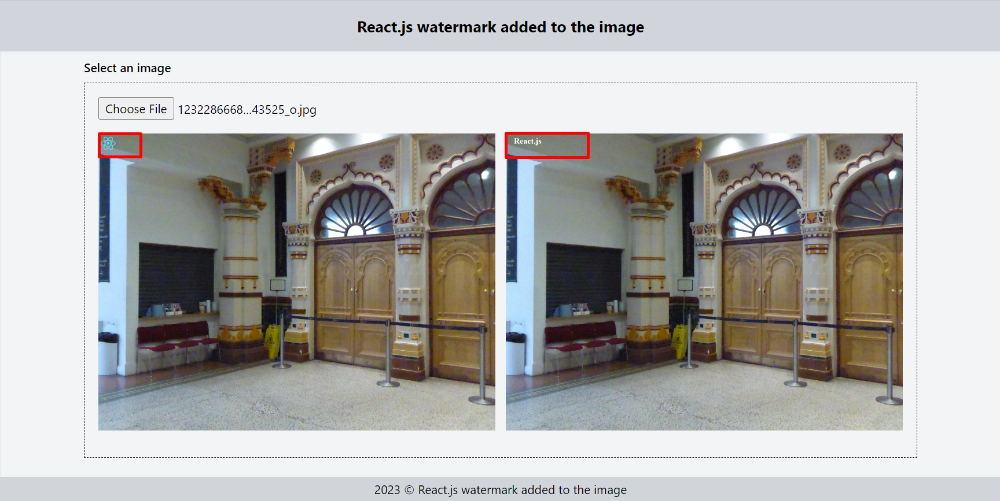

# React.js watermark added to the image

Clone the repository and run `npm install` command in the terminal.

## `npm start`

Runs the app in the development mode.
Open http://localhost:3000 to view it in your browser.
